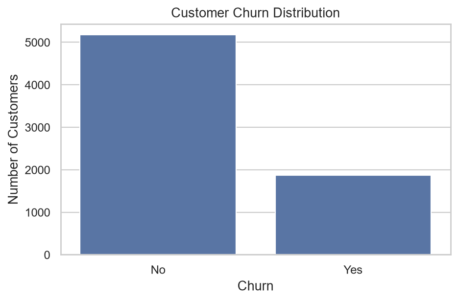
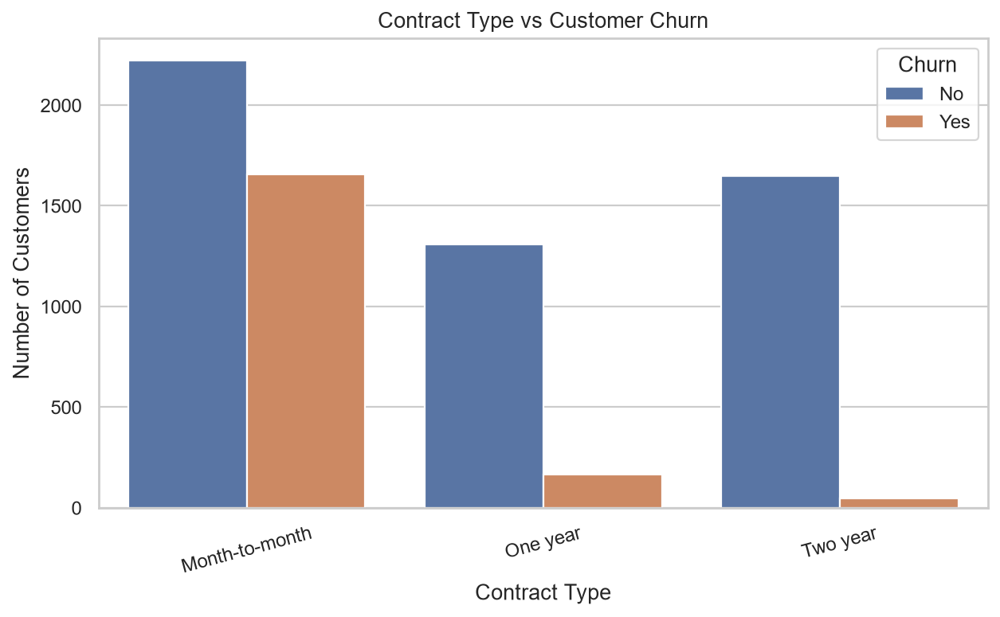
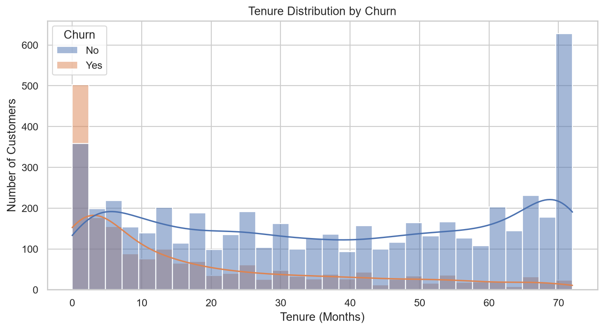
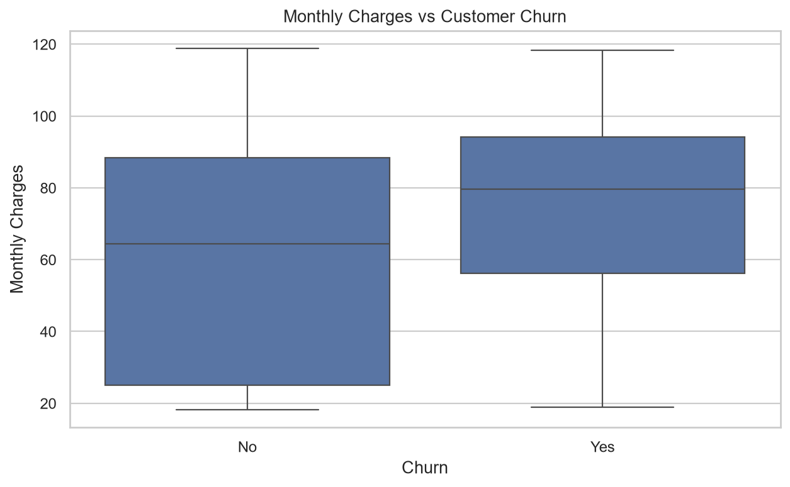
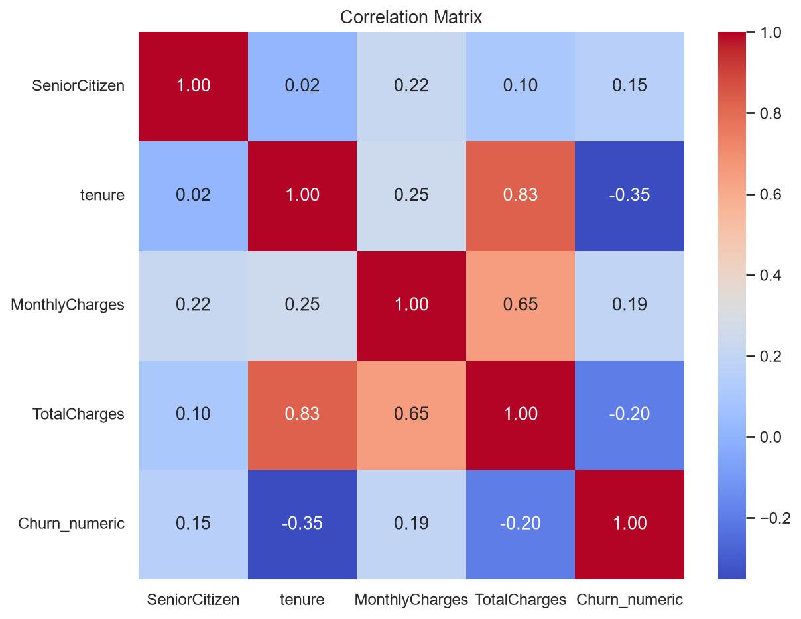

# Telecom Customer Churn Analysis

Exploratory data analysis of customer demographics, service usage, contract details, payment behavior, tenure, and billing information to examine patterns associated with telecom customer churn.

## Project Overview

- **Industry:** Telecommunications
- **Problem statement:** Telecom companies lose revenue when customers discontinue their services. This project examines customer data to identify segments associated with churn and inform customer-retention planning.
- **Proposed analysis:** Explore how churn relates to customer characteristics, services, contract type, payment method, tenure, and charges.
- **Dataset:** Telco customer churn dataset (`Dataset/raw_dataset.csv`)
- **Dataset source:** [Hugging Face — scikit-learn/churn-prediction](https://huggingface.co/datasets/scikit-learn/churn-prediction/tree/main)

This is descriptive exploratory analysis. The observed relationships do not establish causation and are not a predictive model.

## Tools & Technologies

- Python
- Jupyter Notebook
- NumPy
- Pandas
- Matplotlib
- Seaborn

## Project Workflow

**Industry Selection → Problem Identification → Dataset Collection → Data Cleaning → Data Transformation → Data Analysis → Data Visualization → Insights → Recommendations**

### Data preparation

The cleaning script trims text fields, converts `TotalCharges` to numeric values, fills blank charge values with zero, converts `tenure` to numeric, and removes exact duplicate rows. The notebook reports 7,043 rows and 21 columns in the cleaned dataset, with no duplicate or missing rows in its checks.

## Data Analysis & Visualization

The notebook and visualization script include:

- Churn count and proportion distribution
- Churn comparisons across contract type, gender, senior-citizen status, internet service, payment method, partner/dependent status, and service categories
- Tenure distribution and tenure-by-churn comparisons
- Monthly and total charges compared by churn status
- Correlation analysis of numeric customer measures and churn

## Key Insights

The notebook's recorded analysis reports:

- 1,869 of 7,043 customers churned (26.54%); 5,174 did not (73.46%).
- Churn rates differ by contract type: month-to-month 42.71%, one-year 11.27%, and two-year 2.83%.

These are descriptive results from this dataset and should not be interpreted as evidence that contract type causes churn.

## Recommendations

- Prioritize reviewing retention needs among month-to-month customers, who had the highest observed churn rate in this analysis.
- Evaluate any retention actions against subsequent churn outcomes; this analysis does not measure the effect of a retention intervention.

## Visualization Screenshots

### Customer Churn Distribution



### Contract Type vs Customer Churn



### Tenure Distribution by Churn



### Monthly Charges vs Customer Churn



### Correlation Matrix



## Run the Project

Run these commands from the project root after installing the libraries listed under Tools & Technologies:

```bash
python Python/data_cleaning.py
python Python/data_visualization.py
```

The cleaning script writes `Dataset/cleaned_dataset.csv`. The visualization script writes chart PNGs to `Visualizations/` and generates `Documentation/Project_Report.pdf`. The notebook can also be opened in Jupyter.

## Project Folder Structure

```text
Telcom Customer Churn/
├── README.md
├── Dataset/
│   ├── raw_dataset.csv
│   └── cleaned_dataset.csv
├── Notebook/
│   └── sprint.ipynb
├── Python/
│   ├── data_cleaning.py
│   ├── data_loading.py
│   ├── data_visualization.py
│   └── exploratory_analysis.py
├── Visualizations/
│   ├── churn.png
│   ├── Contract type vs Churn.png
│   ├── contract_churn.png
│   ├── correlation_matrix.png
│   ├── customer_churn_distribution.png
│   ├── dependents_churn.png
│   ├── Gender vs Churn.png
│   ├── gender_churn.png
│   ├── Heatmap.png
│   ├── Internet Service vs Churn.png
│   ├── internet_service_churn.png
│   ├── Monthly Charges vs Churn.png
│   ├── monthly_charges_churn.png
│   ├── multiple_lines_churn.png
│   ├── online_security_churn.png
│   ├── Partner vs Churn.png
│   ├── partner_churn.png
│   ├── Payment Method vs Churn.png
│   ├── payment_method_churn.png
│   ├── phone_service_churn.png
│   ├── Senior Citizen vs Churn.png
│   ├── senior_churn.png
│   ├── streaming_services_churn.png
│   ├── tech_support_churn.png
│   ├── Tenure vs Churn.png
│   ├── Tenure(months).png
│   ├── tenure_churn_boxplot.png
│   ├── tenure_distribution_by_churn.png
│   ├── Total Charges vs Churn.png
│   └── total_charges_churn.png
└── Documentation/
    └── Telecom_Customer_Churn.pptx
```

## Author

- **Name:** Vikram C
- **Student ID:** AF05310141
- **Organization:** Anudip Foundation
- **Course:** AIML
- **Batch Code:** ANP-D7444
